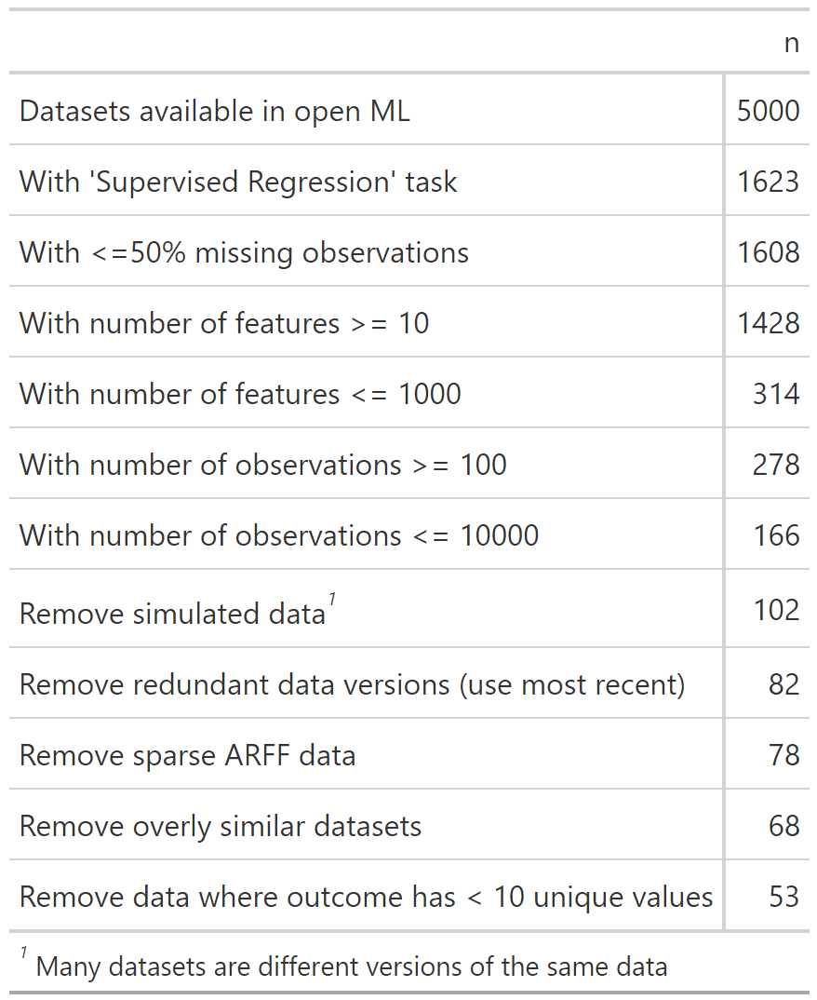
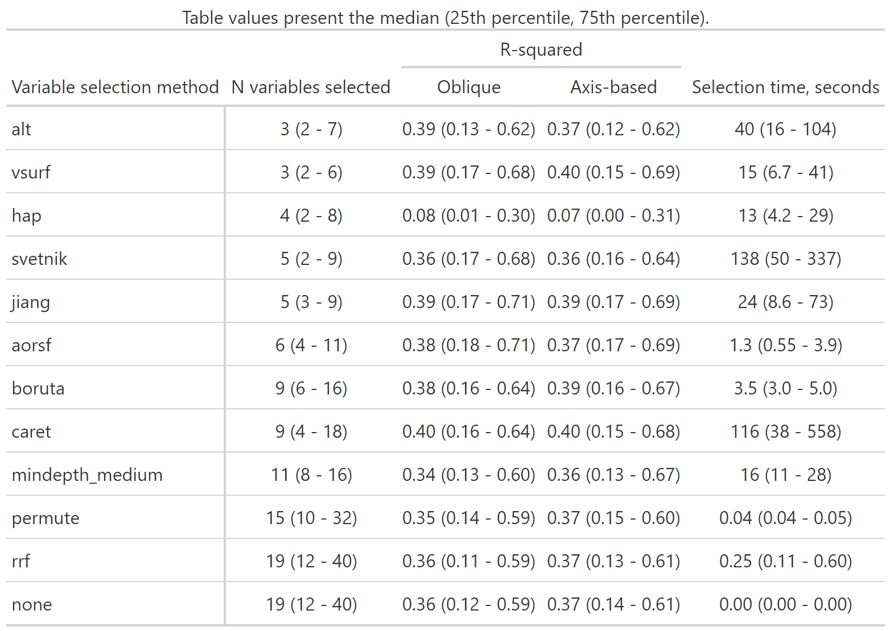
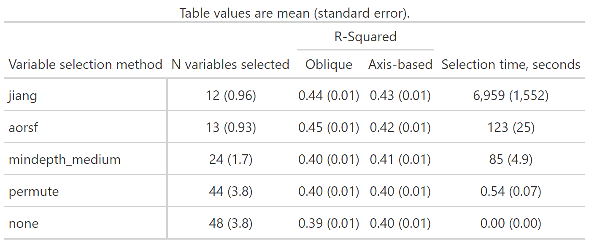
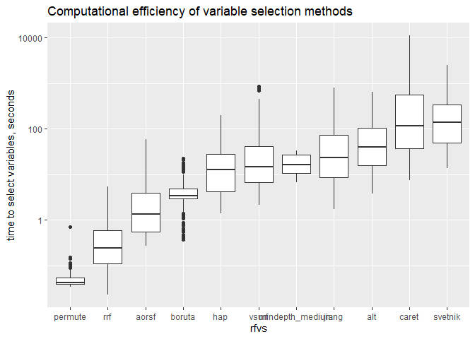
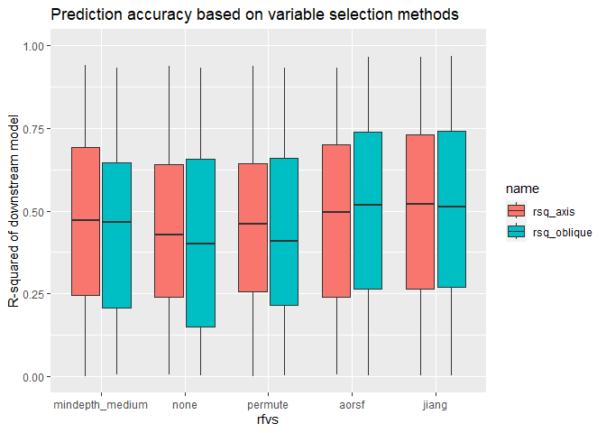

<!-- README.md is generated from README.Rmd. Please edit that file -->

# rfvs-regression

<!-- badges: start -->
<!-- badges: end -->

The goal of rfvs-regression is to compare random forest variable
selection techniques for continuous outcomes

# Datasets included

# Central illustration

The experiment we ran involves three steps:

1.  Select variables with a given method.
2.  Fit a random forest to the data, including only selected variables.
3.  Evaluate prediction accuracy of the forest in held-out data.

*Note*: We use both axis-based and oblique random forests for regression
in step 2.

We assume that better variable selection leads to better prediction
accuracy. Results from the experiment are below.

Similar results, but using mean and standard error

<!-- -->

<!-- -->
